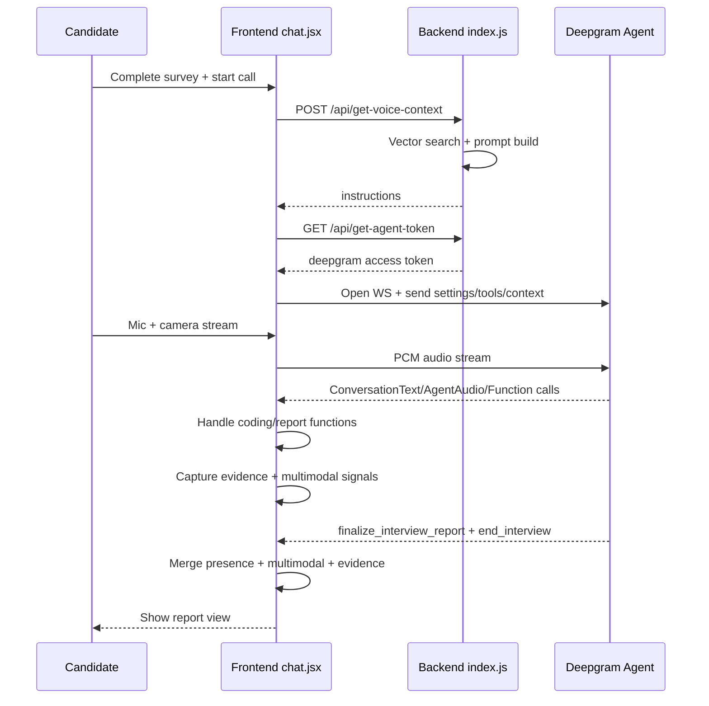

# Intervue AI - End-to-End Architecture and Flow (Presentation Guide)

## 1) Product Goal
Intervue AI runs a live voice interview, adapts difficulty, can trigger coding challenges, analyzes non-verbal + speech behavior, and generates an evidence-linked final report.

This document explains:
- what each module does
- how frontend and backend connect
- where RAG is used (`knowledgeBase.js`)
- how report, scoring, and evidence traces are produced

---

## 2) High-Level System Diagram

```mermaid
flowchart LR
  U[Candidate Browser]
  FE[Frontend React/Vite\nchat.jsx orchestrator]
  DG[Deepgram Agent WebSocket]
  BE[Backend Express\nserver/index.js]
  VS[Vector Store\nSupabase documents table]
  KB[knowledgeBase.js\nembedding ingestion]
  LLM[LLM/Prompt Layer\nvoiceInstructions.js + agent think]

  U --> FE
  FE <--> DG
  FE -->|HTTP get-voice-context|getToken| BE
  BE --> VS
  KB --> VS
  BE --> LLM
  DG --> LLM
```

---

## 3) Frontend Architecture (Client)

## 3.1 Core Orchestrator: `client/src/components/chat.jsx`
Primary runtime controller for:
- interview lifecycle (`idle -> active -> report`)
- WebSocket setup with Deepgram agent
- function-call handling (`enable_coding_mode`, `code_review_result`, `finalize_interview_report`, `end_interview`)
- coding-mode UI open/close and attempt control
- evidence capture and final report enrichment
- live metrics HUD and intelligence bar

Key state groups:
- connection/session: `connectionStatus`, `callEnd`, `socketRef`, audio refs
- interview logic: `codingSession`, `codeTask`, `selectedPersona`, `selectedVoice`
- analytics: `evidenceRef`, `multimodalRef`, `assistantQuestionCountRef`
- report: `interviewReport`, `showReport`

## 3.2 Face / Presence Module: `client/src/hooks/useFaceAnalysis.js`
Purpose:
- compute live presence metrics while call runs
- outputs:
  - `eyeContact`
  - `headStability`
  - `engagement`
  - `presenceScore`

Integration:
- `chat.jsx` passes `videoRef` and `active=!callEnd`
- `getPresenceReport()` merged into final report during `finalize_interview_report`

## 3.3 Coding Module: `client/src/components/codeInterface.jsx`
Purpose:
- display coding prompt
- collect code submission
- enforce attempts with backend-driven review results

Control flow:
- open via `enable_coding_mode` function call
- submit via `handleCodeSubmit` -> InjectUserMessage to agent
- review resolved by `code_review_result`

---

## 4) Backend Architecture (Server)

## 4.1 Runtime API Gateway: `server/index.js`
Endpoints:
- `GET /api/get-agent-token`
  - creates short-lived Deepgram token (`ttl_seconds`)
- `POST /api/get-voice-context`
  - receives survey/session
  - performs vector retrieval
  - builds final interviewer instruction prompt
- `POST /api/voice-telemetry`
  - receives turn timing marks for latency observability

Core runtime responsibilities:
- initialize Supabase vector store
- run similarity search with role/stack/experience context
- fallback to synthetic interview context if vector search fails
- call `VoiceSysInstruction(...)` to build dynamic prompt

## 4.2 Prompt Engine: `server/services/voiceInstructions.js`
Purpose:
- constructs detailed system prompt with persona + rules + flow
- enforces:
  - one-question-at-a-time style
  - tool call discipline
  - coding gating and no-retry after final fail
  - evidence-based report generation

## 4.3 Optional AI Service: `server/services/aiService.js`
Currently contains Groq chat helper. Main live interview path is Deepgram agent + prompt instructions; this file is ancillary for alternative flows.

---

## 5) RAG Pipeline (Knowledge Base)

## 5.1 Offline/Prep Script: `server/knowledgeBase.js`
Purpose:
- generate interview QA corpus by role/stack/difficulty
- embed content
- store vectors in Supabase (`documents` table)

Pipeline steps:
1. Define target role/stack combinations (`TARGETS`)
2. Prompt model to generate structured QA JSON
3. Parse and map into LangChain documents
4. Create embeddings (`text-embedding-004` / retrieval document mode)
5. Upsert into `documents` table through `SupabaseVectorStore.fromDocuments`

Metadata stored per doc:
- `topic`
- `stack`
- `role`
- `difficulty`

## 5.2 Online Retrieval During Interview (`server/index.js`)
At interview start (`/api/get-voice-context`):
1. Receive candidate survey
2. Query vector store:
   - query text: `"<stack> interview questions for <role>"`
   - metadata filter: stack + difficulty
3. Select and shuffle top matches
4. Build compact context string
5. Feed context into `VoiceSysInstruction`
6. Return final instructions to frontend

This gives role-aware, experience-aware grounding for question quality.

---

## 6) Interview Lifecycle (Operational Flow)



---

## 7) Coding Mode Reliability Rules (Current)

Implemented safeguards:
- coding opens only after enough interview questions (readiness gate)
- challenge prompt extraction fallback (`deriveCodingPrompt`) avoids empty generic text
- max attempts = 3
- `FINAL_FAIL` accepted only on final attempt
- after final fail, coding is locked for current interview
- model prompted not to ask retry after final fail

Data points used:
- `assistantQuestionCountRef`
- `codingFinalizedRef`
- `codingSessionRef` (avoids stale closure bugs)

---

## 8) Evidence-Linked Report Pipeline

Evidence collection at runtime:
- transcript evidence (candidate + assistant turns)
- coding evidence (submission + review outcome)
- timestamp and source tagging

Report enrichment:
- model output normalized
- append `evidence_links` built from runtime evidence
- rubric cards map to likely evidence via keyword matching
- click trace -> jump/highlight evidence card

Why this matters for judges:
- score explainability
- auditability
- non-black-box evaluation narrative

---

## 9) Multimodal Integrity Score

Inputs:
- face-presence composite (eye/head/engagement)
- speech clarity signals (avg words/turn, filler rate, pause cadence)
- response readiness signal (coding outcome)

Output:
- `multimodal_integrity.score` (0-100)
- `label` (`high/moderate/low`)
- factor breakdown for explainability

Use cases:
- live interviewer intelligence bar
- final report confidence signal

---

## 10) Live Interview Intelligence Bar (Presentation Feature)

Displayed during active call:
- `Q Depth`
- `Coding Readiness`
- `Multimodal`
- `Risk Flags`

Purpose:
- real-time transparency of interviewer adaptation
- strong demo moment for judges

---

## 11) Failure/Fallback Paths

1. Vector retrieval unavailable
- backend uses fallback handcrafted context

2. Model emits vague coding prompt
- frontend reconstructs prompt from recent assistant message

3. Premature final fail
- frontend downgrades to normal fail unless final attempt

4. Camera unavailable
- report still computes multimodal score from speech/coding channels

---

## 12) Key Integration Contracts

Function tools expected from agent:
- `enable_coding_mode`
- `code_review_result`
- `finalize_interview_report`
- `end_interview`

Frontend merge points:
- `finalize_interview_report` -> normalize + merge presence + multimodal + evidence_links

Backend context contract:
- `surveyData` + `sessionId` -> instructions

---

## 13) Demo Talk Track (Short)

1. "We ground interview quality with RAG by role/stack/experience from our Supabase vector store."
2. "The agent adapts live and shows transparent intelligence metrics during interview."
3. "Coding is controlled with strict attempt logic to prevent UX/model drift."
4. "Final scoring is evidence-linked and explainable, not black-box." 

---

## 14) Files to Show in Presentation
- `client/src/components/chat.jsx`
- `client/src/hooks/useFaceAnalysis.js`
- `server/index.js`
- `server/services/voiceInstructions.js`
- `server/knowledgeBase.js`

